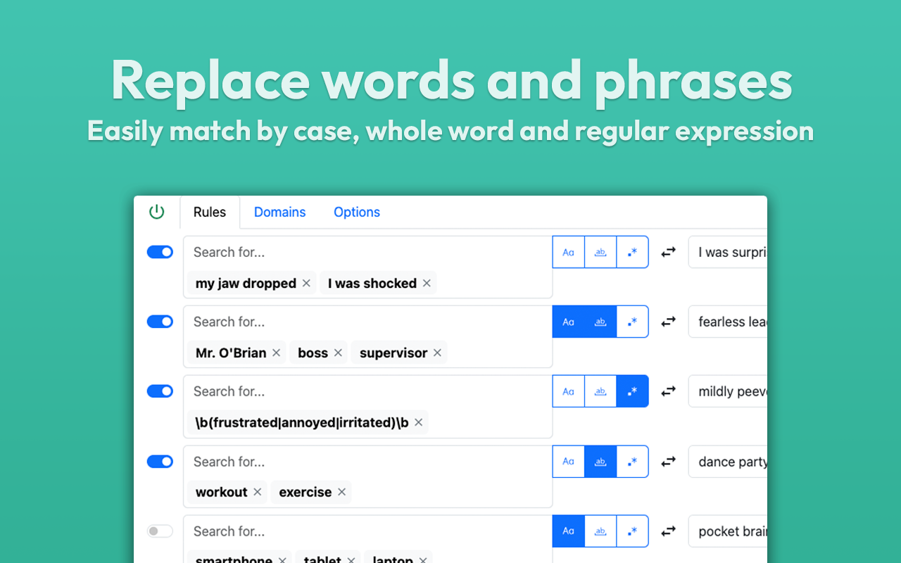
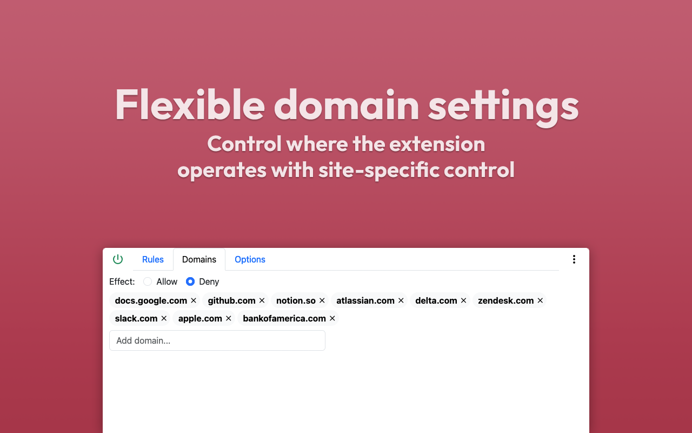
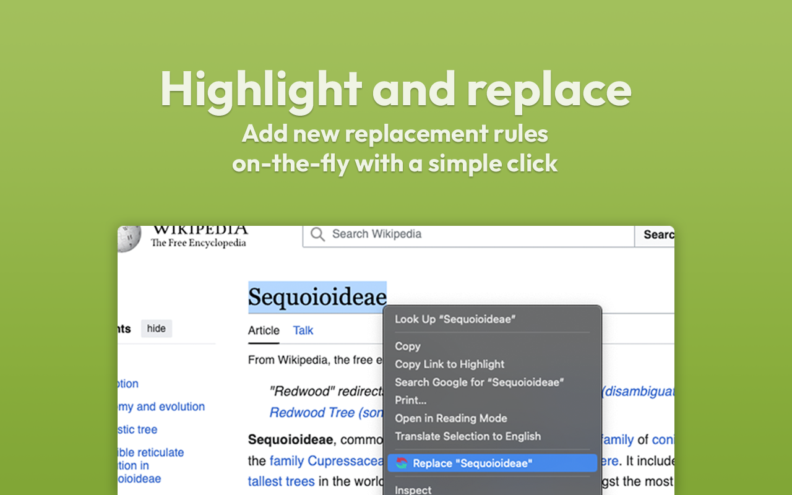
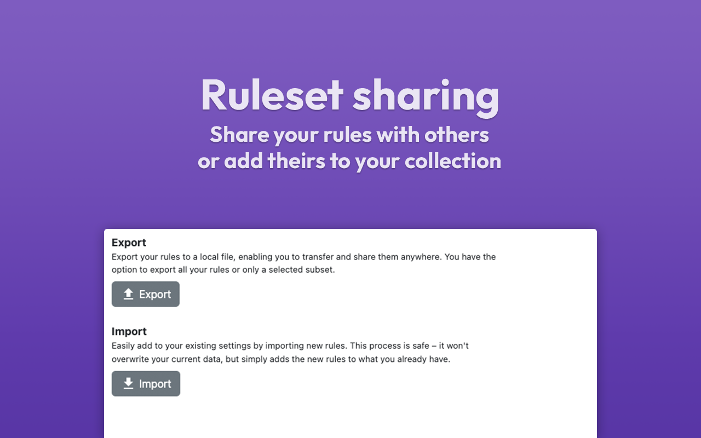

# Word Replacer Max

A browser extension for replacing text on webpages.

## Available for [ Chrome](https://chromewebstore.google.com/detail/word-replacer-max/gnemoflnihonmkiacnagnbnlppkamfgo) and [ Firefox](https://addons.mozilla.org/en-US/firefox/addon/word-replacer-max)

</img>
</img>
</img>
</img>

# Building locally

To get started, you'll need:

- [NodeJS](https://nodejs.org/en) v18 or higher
- [Yarn](https://yarnpkg.com/) package manager

## Instructions

1. Install dependencies
   ```
   yarn install
   ```
1. Run the `build` command using whichever manifest version you desire (`2` or
   `3`)
   ```
   yarn build 3
   ```
1. The resulting build exists in the `dist` directory which can be used to load
   an unpacked extension in your browser

# Developing

After following the dependency installation instructions above, use the
`start:*` command to start a development server using a given manifest version.
For version 2:

```
yarn start:2
```

File changes can be seen in real-time and may require the extension to be
reloaded.

# Packaging

1. Bump the version in `package.json`
1. Run the `package` command, targeting the correct manifest version
   ```
   yarn package 3
   ```
1. The resulting package exists in the `versions` directory which is to be used
   when uploading a new version to the extension stores
