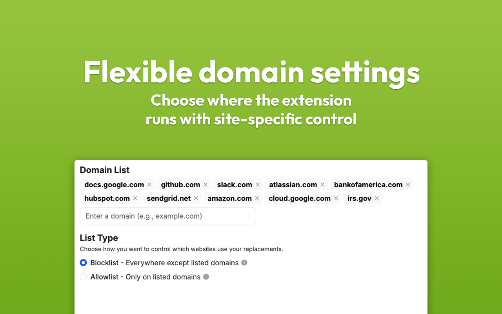

#  Word Replacer Max

A browser extension for replacing text on webpages.

## Available for [ Chrome](https://chromewebstore.google.com/detail/word-replacer-max/gnemoflnihonmkiacnagnbnlppkamfgo) and [ Firefox](https://addons.mozilla.org/en-US/firefox/addon/word-replacer-max)

</img>
</img>
</img>
</img>

# Building locally

To get started, you'll need:

- [NodeJS](https://nodejs.org/en) v18 or higher
- [Yarn](https://yarnpkg.com/) package manager

## Instructions

1. Set the target environment
   There are three different possible environments: `production`, `development` and `test`.
   You have to set your desired target environment using the environment variable `NODE_ENV` to one of those three values in order to build the project (like `export NODE_ENV=development`).
   The selected environment only changes linked the origin website & API endpoints for the integrated account system: While `production` connects the extension to to the production API, `development` and `test` allow it to connect to a local running API for debugging and testing purposes.

1. Install dependencies

   ```
   yarn install
   ```

   - ⚠️ IMPORTANT: In order to test in Firefox, you need to build AmplifyJS
     locally and link its `@aws-amplify/core` package to this project (bug
     report here: https://github.com/aws-amplify/amplify-js/pull/14180):
     1. Update the fork https://github.com/dan-lovelace/amplify-js and clone it
     1. Checkout branch `core/fix-convert-firefox-context`
     1. Run `yarn build`
     1. Run `yarn link-all`
     1. Change back into the WRM repository
     1. Run `yarn link @aws-amplify/core`
     1. Run `yarn install` (use with the `--force` flag when `unlink`ing)

1. Run the `build` command using whichever manifest version you desire (`2` or
   `3`)
   ```
   yarn build 3
   ```

1. The resulting build exists in the `dist` directory which can be used to load
   an unpacked extension in your browser

# Developing

After following the dependency installation instructions above, use the
`start:*` command to start a development server using a given manifest version.
For version 2:

```
NODE_ENV=development yarn start:2
```

File changes can be seen in real-time and may require the extension to be
reloaded.

## Running tests

### Prerequisites

- A file `packages/popup/cypress/.env.private` populated with testing
  credentials - Contact the repository owner if you do not have these.

### Steps

To run all tests:

1. Start the Popup development server in test mode
   ```sh
   VITE_MODE=test yarn workspace @worm/popup dev
   ```
1. Use the "test all" command
   ```sh
   yarn test:all
   ```

See the individual `test:*` commands in `package.json` to run specific types of
tests.

# Packaging

1. Bump the version in `package.json`
1. Run the `package` command, targeting the correct manifest version
   ```
   yarn package 3
   ```
1. The resulting package exists in the `versions` directory which is to be used
   when uploading a new version to the extension stores
