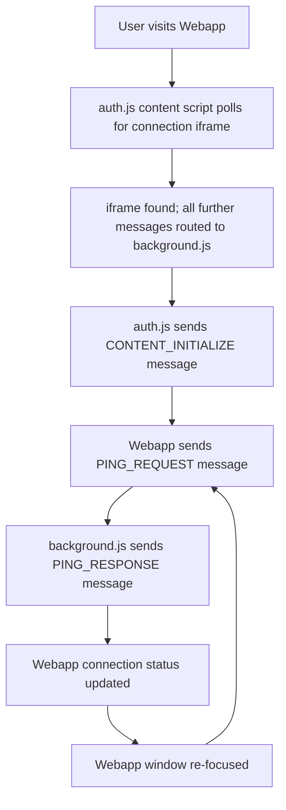

# @web-extension/auth

The Auth script only runs on the Webapp's domain and is charged with
authenticating the user. After they leave the domain, authorization is
maintained using Amplify in the Background script.

## Webapp connection flow

When the user navigates to the Webapp with the extension installed, a connection
attempt is made between the two. This is done through a series of messages
passed between a special iframe rendered in the Webapp.

Three main message listeners exist:

1. **Webapp** - This is where the connection iframe exists and a message
   listener is attached to its content window. Messages are posted to it from
   the Webapp with the intention of delivering information to the Background
   script.
1. **Auth script** - This is a content script that only runs on the Webapp's
   domain. It also attaches a message listener to the connection iframe and
   serves as a proxy between the Webapp and Background script. Instead of window
   message events, it emits events to the extension's runtime.
1. **Background script** - This is where the runtime message listener is
   attached. Various things within the extension's context occur such as
   updating local storage with auth tokens.

### Data flow

